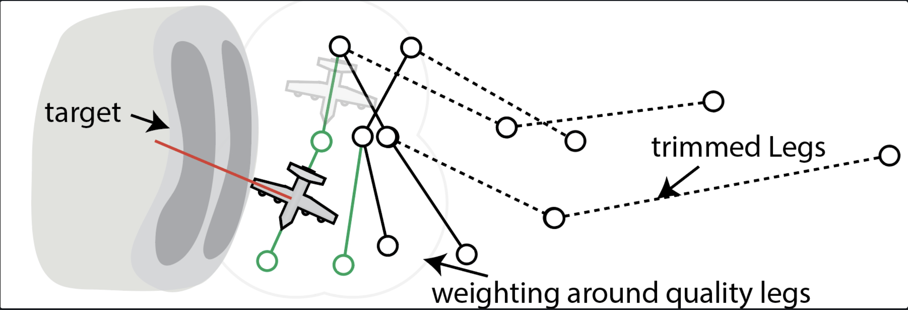
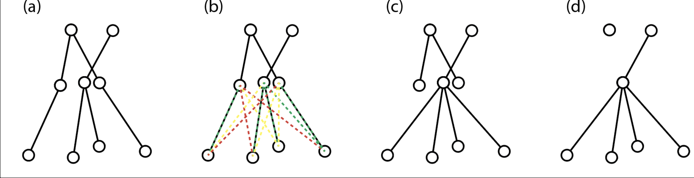

This program utilizes a modified version of the rapidly expanding random trees (RRT) pathfinding algorithm (LaValle and Kuffner 1999). The modifications to the algorithm encourage faster convergence on an optimal path and do not require a set "target" for the pathfinding algorithm to locate. Instead, our algorithm builds the network of paths and dynamically chooses an optimal path by measuring the "quality" of a path based on predefined constraints. In brief, RRT is a pathfinding algorithm that randomly samples points in the environment and connects those points to an ever-expanding network of paths.

Here, the quality of a path segment is the sum of several cost functions that are based on the aircraft's motion, local environment, and ability to observe a given target. First, turbulence—defined as the range of vertical velocities measured along a given flight leg—is a cost to be minimized along the path. An additional cost to consider is the frequency of heading changes. Thus, for a path to be valid, it must have turbulence or a turning rate above a preset value. If either of these values is less than the maximum value and larger than zero, the cost increases at a rate of $w_i sin(r*pi/2)$, where $w_i$ is the preset weight associated with each cost and $r$ is the ratio of the heading rate of change or turbulence divided by their respective maximum values. $r\in[0,1]$, and is rounded to the nearest maxima in cases where it is larger or smaller than the limits.  Each cost reduces the quality of a leg.

An optimal path permits observation of a particular meteorological target, but not all observations are equally useful. An observation must be close enough to the target so that the angular resolution is not coarse but far enough away that it has good coverage of the target. Much like the costs mentioned above, the quality of a leg is increased for each target the aircraft can observe. The total quantity of this increase depends on the range at which the target is observed. We first set an optimal distance of 5~km, a minimum range of 1~km, and a maximum range of 50~km. The adjusted quality enhancement follows the same sinusoidal function as above but $w_i$ is the weight of the observed target and $r$ ratio of target distance to distance between optimal and minimum or maximum distances, respectively. This is so that paths that observe targets at distances larger or smaller than the maximum or minimum do not receive quality enhancements.

The network is then grown by attaching new, randomly sampled nodes to pre-existing legs, measuring the quality of the legs, and iterating a set number of times or until a leg reaches a particular length or quality. The `TrainingOptions.nLoops` and `TrainingOptions.parallel` variables control the number of iterations and the number of new nodes to add to the network simultaneously (i.e., the nodes in a single parallel computation will not build on one another, just the pre-existing network). Progressing in this manner, an optimal path will be approached asymptotically.

However, there are several optimizations that we can include to approach an optimal path faster. First, we can favor locations near other quality legs instead of randomly sampling the entire environment. This means the high-quality legs will receive more opportunities to increase their quality. The light grey contours around the green paths illustrate this feature, and as more high-quality legs are added, this favored region will grow to accommodate. Then, for every iteration during training, the relative weight of the quality region is increased—increasing the number of sampled points near the best paths and reducing the amount of computing on poor-performing legs. The factor controlling this is the `TrainingOptions.learningRate`, which can be adjusted in the GUI or via the API. The default value is `0.008`. Set at this value, the network will spend the first $\frac{0.5}{0.008}\sim 63$ iterations learning the environment before only sampling points near high quality legs. For complex environments, the learning rate should be lower than the default, but simpler environments may benefit from a higher learning rate.

The second enhancement is what we name network trimming. To elaborate, there are essentially two main phases to flight path training: environment discovery and flight optimization. In the earliest phases of training, the network expands to fill the environment. However, after it has done so, there will be extraneous branches in the network that will never produce a quality path during the optimization stage of training, and the existence of such poor-quality legs in the network can be a substantial computing bottleneck. Thus, at a set rate (the `TrainingOptions.trimRate`), the lowest quality paths are pruned. The `TrainingOptions.trimAggression` variable is used to calculate the minimum average quality (measured as the percentile of all path quality) for a branch of length `TrainingOptions.trimLength` to reach to be kept. Setting the `trimAggression` to 98 and `trimRate` to 2 is generally sufficient. For example, the paths marked with dashed lines will be trimmed in the figure below because their quality is lower than that of the solid paths.

Lastly, due to the stochastic nature of RRT, there will come a time during training when many nodes are placed very closely. This can needlessly increase the computing time for each iteration. To illustrate this issue, the three middle nodes in panel a of the below figure represent nodes that are too close. So, at a rate of `TrainingOptions.condensationRate`, all nodes that are `TrainingOptions.condensationRadius` pixels or less apart will be collected. Then, out of each cluster of nodes, the node with the highest quality to all children nodes (see panel b) is then attached to the children nodes (panel c). The other remaining nodes in the cluster are then removed. One of the limits placed on the network is that each node has a single parent node, as it makes the interpretation of the graph slightly easier; this method of graph condensation may produce slight errors by removing connections from grandparent nodes (those long the first row in the following figure; see the dropped connections from c to d). However, since the network is always condensing (every 2–5 iterations) and the condensation radius is small (less than 3 pixels), the computing effort to repair the small condensation error is less than that required of the pre-condensed network.

# Works Cited

LaValle, S. M., and J. J. Kuffner, 1999: Randomized kinodynamic planning. _Proceedings 1999 IEEE International Conference on Robotics and Automation (Cat. No.99CH36288C)_, Vol. 1 of, International Conference on Robotics and Automation, Detroit, MI, USA, IEEE, 473–479.