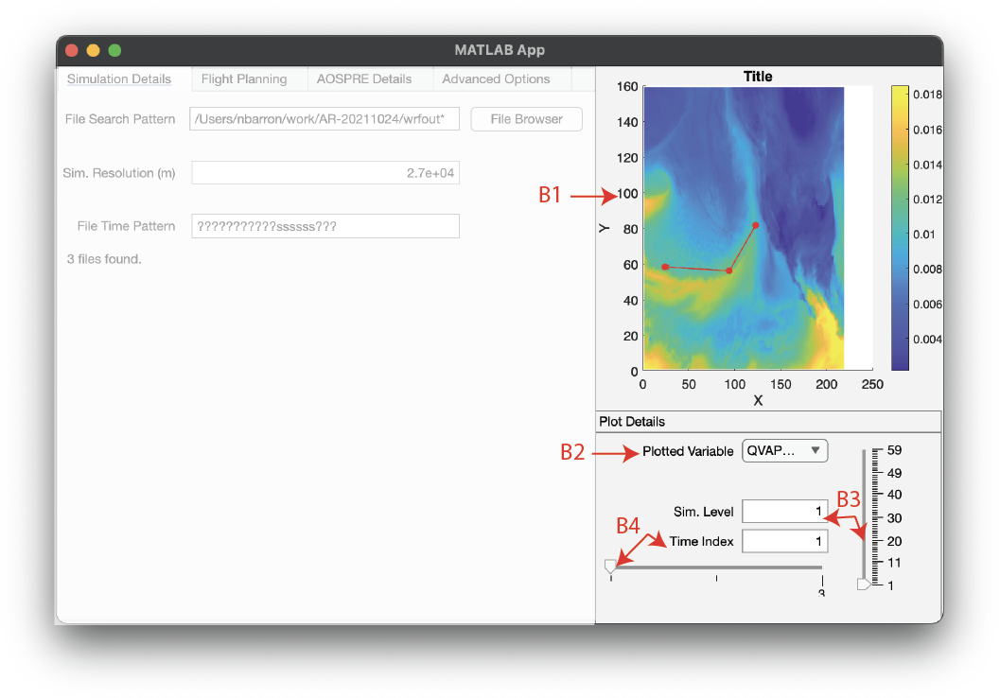
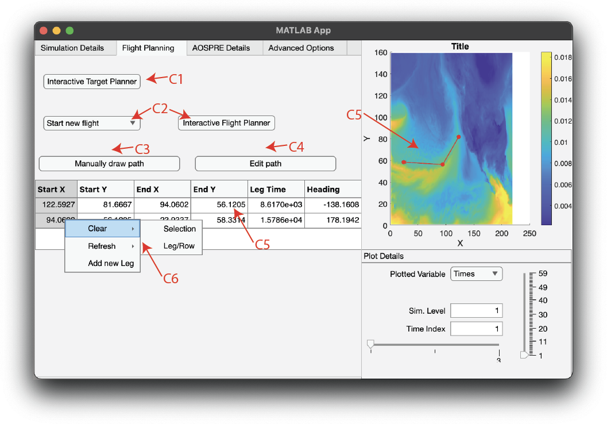
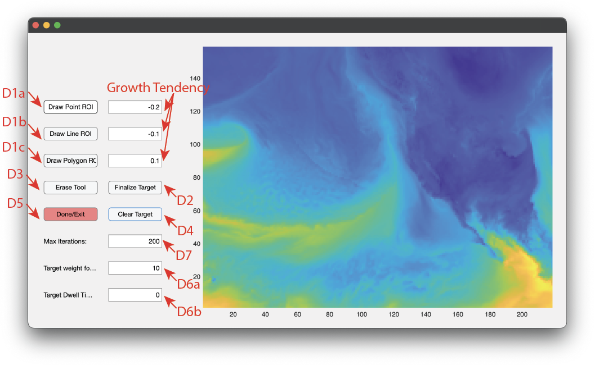
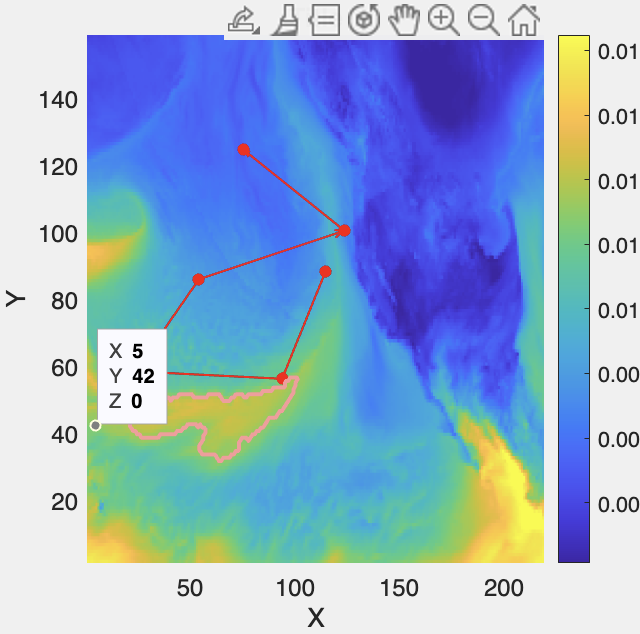
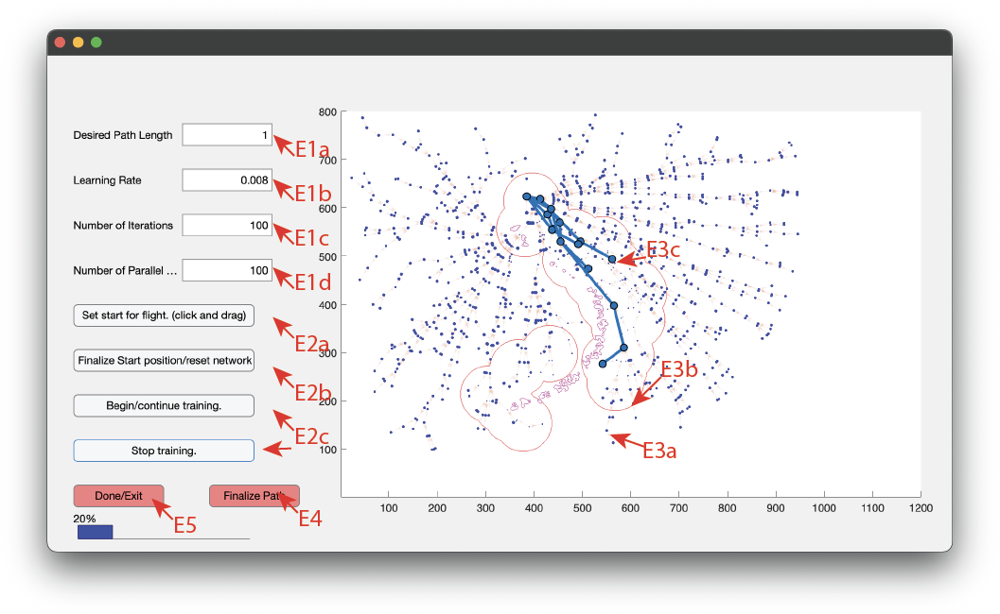
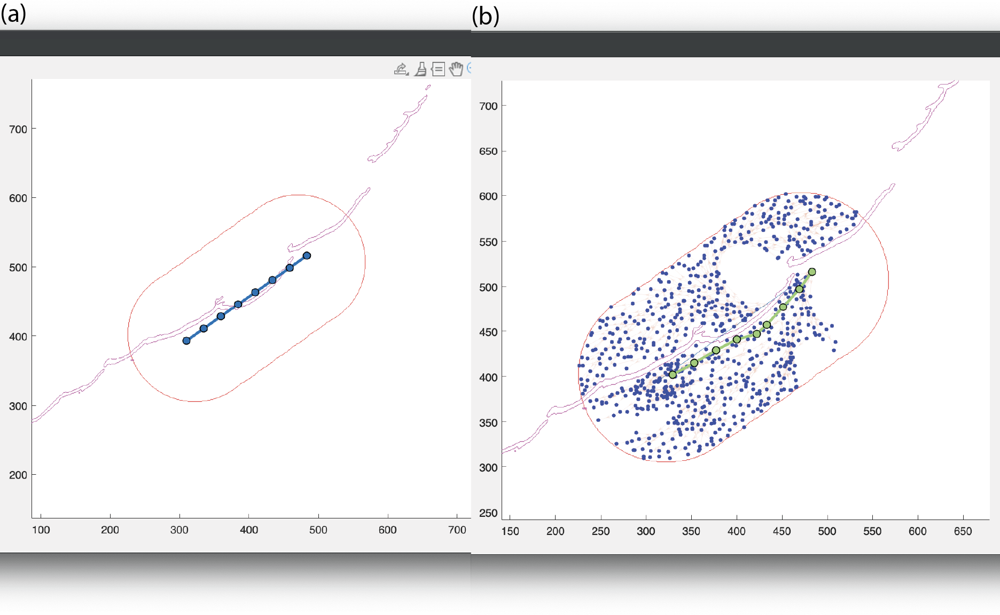
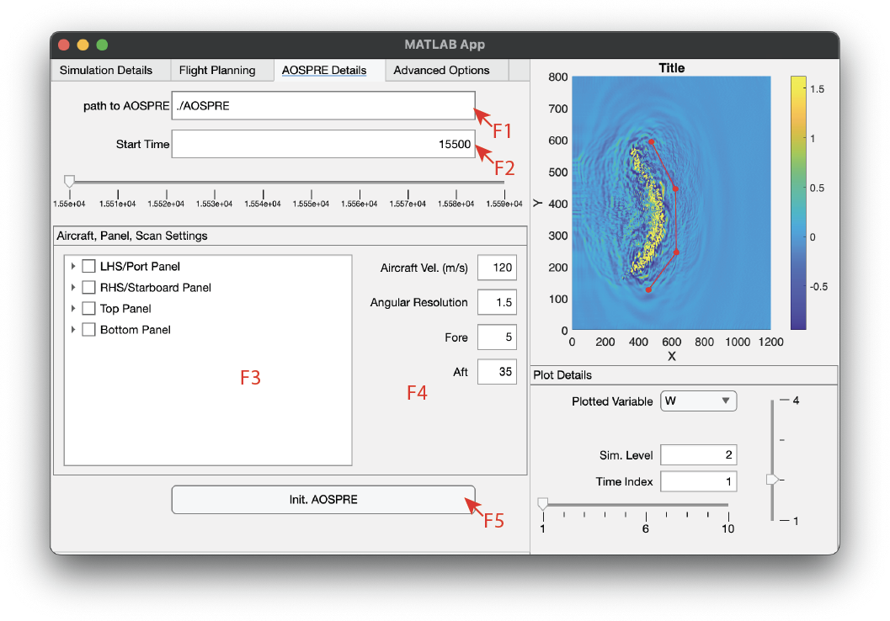
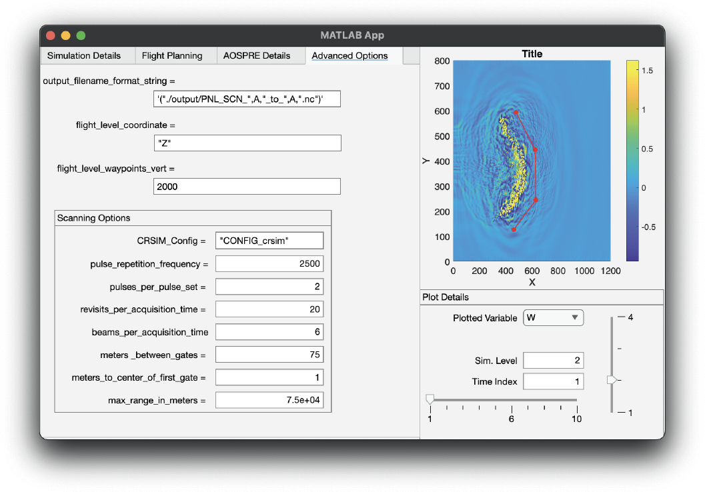

# AOSPRE-GUI instructions
The following instructions will guide you through the various processes of AOSPRE-GUI. 

## Table of Contents
0. [Running AOSPRE-GUI](#running-aospre-gui)
1. [Selecting a simulation](#data-selection)
2. [Data visualizing](#data-visualization)
3. [Flight planning](#flight-planning)
4. [AOSPRE details](#aospre-details)
5. [Running AOSPRE](#running-aospre)
6. [Advanced settings](#advanced-settings) 

# Running AOSPRE-GUI
To run AOSPRE-GUI, navigate to the `aospre-gui` directory in your terminal and run the following command (you may need to change the path, or add the `scripts` directory to your MATLAB path):
```bash
matlab -r "run('aospregui.mlapp')"
```

You may also run the `aospregui.mlapp` file directly from the MATLAB GUI by navigating to the aospre-gui directory and double-clicking the file.

# Data selection
## Data preprocessing
### moving/renaming wrfout files
To ensure compatibility with AOSPRE, you must preprocess the simulations you wish to use by renaming the simulation's output files to elapsed seconds (e.g., `wrfout_0015500s.nc` where there has been 0015500 seconds since the start of the simulation). 

The python script [`wrfoutToAOSPRE.py`](../scripts/helpers/wrfoutToAOSPRE.py) has been provided for the user as a template in cases where the data is not in the default `wrfout_d0X_YYYY-MM-DD_HH:MM:SS` format. If your data is in this format, and you are alright with having the files renamed, you can move to the next section, and the GUI will automatically rename the files for you. 

You can manually call [`wrfoutToAOSPRE.py`](../scripts/helpers/wrfoutToAOSPRE.py) using the following syntax
```bash
python /path/to/wrfoutToAOSPRE.py -in /path/to/wrfoutFiles -out /path/to/workingDirectory -o mv
```

### creating symbolic links to wrfout files
It may be preferred to simply link the wrfout files to a working directory instead of moving/renaming the files themselves. If this is how you want to use the data, you can use [`wrfoutToAospre.py`](../scripts/helpers/wrfoutToAOSPRE.py). The default behavior is to link the files instead of moving them. I.e.,
```bash
python /path/to/wrfoutToAOSPRE.py -in /path/to/wrfoutFiles -out /path/to/workingDirectory
```
or
```bash
python /path/to/wrfoutToAOSPRE.py -in /path/to/wrfoutFiles -out /path/to/workingDirectory -o ln
```

## Selecting the data
- The first step in using AOSPRE-GUI is to select the data you want to use for your simulation. You can do this by manually typing the path to the data ([ File Search Pattern (A1)]()) or by using the file browser to navigate to the data ([A2]()). If the software detects data saved in an incorrect format, it will prompt you to automatically rename the files, simply press "Yes". Note: this process assumes that the filenames are in the default `wrfout_d0X_YYYY-MM-DD_HH:MM:SS` format.

 

- The software will try to guess the resolution of the data based on the `XLAT` and `XLONG` variables in the data, check to make sure this is correct. You can manually correct the resolution in [Sim. Resolution (m) (A3)]() if necessary.
- If everything proceeds without error, you can move to the [next section](#data-visualization).

- However, if there is an error selecting or preprocessing the data, you will see a message in [A5]() that will guide you on how to proceed.

- Lastly, you may manually set the format for for the time search pattern in the filenames. The default should be correct for most users, but if you have a different format, you can set it in [File Time Pattern (A4)](). The `?` character is a wildcard that will match any character, then set the `s` character at locations in the filename string that corresponds to the elapsed seconds. For example, the image above reflects a filename of `wrfout_0015500s.nc`.

# Data visualization
A simple plotting tool is provided that allows the user to visualize the data and flight paths at the same time. (Please note that with new updates, the data is now plotted alongside a simple map and is shown in the proper projection. This has no change on anything other than the visualization)

- [B1](./images/data-visualization.png) shows the selected variable (yellow to blue color scale) and the flight path (red line).
- [Plotted Variable (B2)](./images/data-visualization.png) will open a drop down containing all of the variables in the data. The program will try to select the vertical velocity `W`, `Q`, or `QVAPOR` variables by default. 
    - Note: due to the nature of these data, there is no filtering out variables that are not plotted well (i.e., `TIMES`, `XLAT`, `XLONG`, etc.), if you encounter an error like "'Limits' must be a 1-by-2 array of real finite numbers that are increasing." in [A5](./images/data-selection.png), you should select a different variable.
- The slider and edit field [Sim. Level (B3)](./images/data-visualization.png) allow the user to select the the level to plot. The program automatically selects the vertical level with the highest standard deviation for the selected variable, but you can change it to any level in the simulation.
- The slider and edit field [time Index (B4)](./images/data-visualization.png) allow the user to select the time step (or file corresponding to said time step) to plot.
- There is a blue contour around the flight path that shows the area that the aircraft can observe. You can set the radius of this contour by changing the `max_range_in_meters` variable in the [Advanced Settings](./images/advanced-settings.png) tab. The default is 75000 m.

# Flight planning
## Manual flight planning
The flight planning tool allows the user to plan a flight path through the simulation data. The user can select the start and end points of the flight path, as well as the number of waypoints in between. There is also an automated flight planning tool that will generate a flight path that tries to optimize the path based on how well it observes a given target.

- For [Interactive Target Planner (C1)](./images/flight-planning-1.png) and [Interactive Flight Planner (C2)](./images/flight-planning-1.png) see [Automatic flight planning](#automated-flight-planning) for more information on the automated flight planning tool. There are three options, `New`, `Continue`, and `Optimize` which are described in more detail in the [Automated flight planning](#automated-flight-planning) section.
- [Manually Add flight leg (C3)](./images/flight-planning-1.png) opens up a tool for the user to manually draw waypoints on the map (see [C7](./images/flight-planning-1.png)). After pressing the button, hover over the map and click to place a waypoint. The GUI will update with a blue polyline after each waypoint (see the [figure below](./images/flight-planning-2.png)). Press `Enter` on the keyboard to finish placing waypoints. If a flight path is already on the map, the tool will start building the path from the last waypoint in the preexisting path.


- To edit the path, press [Edit flight leg vertices (C4)](./images/flight-planning-1.png). This will draw an interactive polyline on the map over the preexisting path. You can click and drag the waypoints to move them. Click [Edit Path (C4)](./images/flight-planning-1.png) again to finalize the path.
- [C5](./images/flight-planning-1.png) is a table of all legs on the flight path and their corresponding metadata:

| Column | Description |
| --- | --- |
| `Start X/Y` | The starting point(s) of the leg in the simulation space |
| `End X/Y` | The ending point(s) of the leg in the simulation space |
| `Leg Time` | The time it takes to traverse the leg. The calculation is based on the aircraft velocity (default = 120 $m s^{-1}$; set in the next page) and the resolution of the simulation (set in the previous page)|
| `Heading` | The heading of the leg in degrees following the math convention (degrees clockwise of East). |


- By selecting a portion of the data in [C5](./images/flight-planning-1.png) and right-clicking, the context menu [C6](./images/flight-planning-1.png) will open. This gives the user several options to manually manipulate the flight path:
    - `Clear/Selection` will set the selected cells to `NaN`. 
    - `Clear/Leg/Row` will delete the entire row of the selected cell.
    - `Refresh/Selection` will refresh the selected cells with the current data in the table. Since there are three pairs of data in the table (start x+y, end x+y, and leg time+heading), you can clear one pair of the data, change any of the other two pairs, and then refresh the table to recalculate the missing pair.
    - `Add new Leg` will add a new row of `NaN`s to the table. The user can then manually input the data for the new leg. If there is an empty row at the end of the table and the user begins to manually draw a new path, the program will automatically fill in the table with the new path data.
- [C8](./images/flight-planning-1.png) shows the outline of the target selected in the [Interactive Target Planner (C1)](./images/flight-planning-1.png) tab. The target will be shown as a thin contour on the map for each target.
- Lastly, [C9–C11](./images/flight-planning-1.png) controls the time deformation of the flight path. These are described in more detail in the [Adding background motion to the flight planning/target acquisitions](#adding-background-motion-to-the-flight-planningtarget-acquisitions) section.
## Automated flight planning
The automated flight planning tool allows the user to iteratively plan optimized flight paths through a given simulation. These are based on how well the flight path observes the target and how safe the flight path is to travel. 
### Target selection application
The first step is to choose a target for the flight to observe.

To do this, select [Interactive Target Planenr (C1)](./images/flight-planning-1.png) and a new window will open (see below).
.
- There are three different options for choosing the target. This algorithm is based on the active contours model (Chan and Vese 2001), which is a method for segmenting images based on a 'seed' point(s), a growth tendency, and number of iterations (default is 200; set in [Max Iterations (D7)](./images/target-planning-1.png)). Positive growth tendencies tends to shrink, negative tends to grow; however, for exceptionally smooth fields (like the one shown here), you will need to use a more aggressive positive value and vice versa.
    - [Draw Point ROI (D1a)](./images/target-planning-1.png) allows the user to put point ROIs on the map. Press `Esc` to finish placing points. The default growth tendency is `-0.2`, since the growth algorithm must often grow substantially outwards from each point to capture the entire target.
    - [Draw Line ROI (D1b)](./images/target-planning-1.png) allows the user to draw a polyline ROI on the map. To finish, press `Enter`. The default growth tendency is `-0.1`, since the region must grow to fill the target, but not as much as the point ROI.
    - [Draw Polygon ROI (D1c)](./images/target-planning-1.png) allows the user to draw a polygon ROI on the map. To finish drawing, completely enclose the polgygon around the desired target. The default growth tendency is `0.1`, since the region must shrink around the target.
- When you are done, the program will attempt to segment the target from the background image (see below).  

- If you are satisfied with the results, click on [Finalize Target (D2)](./images/target-planning-1.png) to finalize the target. You may then add a new target by following the same steps. 
- If you are not satisfied:
    - You may erase contiguous regions of the target by selecting [Erase Tool (D3)](./images/target-planning-1.png) and clicking on the map (press `Esc` to finish). 
    - You can also clear the entire target by selecting [Clear Target (D4)](./images/target-planning-1.png).
- After adding all targets, cleaning up the targets, and finalizing the targets, select [Done/Exit (D5)](./images/target-planning-1.png) to close the window, export the targets to the main AOSPRE-GUI software, and return to the flight planning page.

#### Target metadata
- Finally, in cases where a certain target is more important, you can assign a weight to each target before finalizing. Enter your desired weight in [Target Weight (D6a)](./images/target-planning-1.png). The flight planning program functions best when the weight of targets is greater than 5 and less than 30.
- [Target Dwell Time (D6b)](./images/target-planning-1.png) allows the user to set the desired dwell time for each target. This is the amount of time the aircraft should spend observing the target. The default is 0 seconds, which means the aircraft has no limit on how long it can observe the target before the weight of the target is reduced. This setting is not yet fully implemented in the flight planning algorithm, but it will be in the future.

### Flight planning application
After selecting the targets, the user can begin the automated flight planning process. First, in the dropdown [C2](./images/flight-planning-1.png) select "New to erase any existing flight path, "Continue" to build off a preexisting path, or "Optimize" to optimize the currently drawn path. We have had the most success using the "Optimize" Then select `Interactive Flight Planner`. A new window will open (see below). This algorithm is a modified version of rapidly expanding random trees (LaValle and Kuffner 1999). The details of this algorithm are in [flight-planning-details.md](./flight-planning-details.md).


### "New" flight planning
This option will erase any existing flight path and you will need to set the start by first clicking on the [Set Start for flight (E2a)](./images/flight-planning-3.png) button and clicking and dragging from the desired start point. The start point will be set as the area at which the mouse button was first depressed, the heading will be set by the direction in which the mouse is moved. This will draw a red arrow line on the map that reflects these settings. After you are happy with this start/heading, press [Finalize Start position/reset network (E2B)](./images/flight-planning-3.png), and finally [Begin Training (E2c)](./images/flight-planning-3.png) to begin the training process.

### "Continue" flight planning
This option will build off a preexisting flight path. The start will be assigned as the final point in the preexisting path. Press [Finalize Start position/reset network (E2B)](./images/flight-planning-3.png), and [Begin Training (E2c)](./images/flight-planning-3.png) to begin the training process.

### "Optimize" flight planning
This option will optimize the currently drawn flight path. This tool is best when the user has a "start" and "end" point in mind, but wants to optimize the path in between. 

For example, a user can set the start and end of a flight path so that the path crosses over an arching MCS with high vertical velocity. The optimal flight path is one that curves around the arch. See the example below. (a) shows the initial path, (b) shows the optimized path.



#### Training settings
- [Desired Path Length (E1a)](./images/flight-planning-3.png) sets the desired path length (in hours) for the flight.
- [Learning Rate(E1b)](./images/flight-planning-3.png) sets the learning rate. This is how quickly the algorithm reduces the number of random samples in the environment vs. the number of samples near high-quality paths. The default is `0.008`, which means the algorithm will spend the first $\frac{0.5}{0.008}\sim 63$ iterations learning the environment before only sampling points near high-quality legs. For complex environments, the learning rate should be lower than the default, but simpler environments may benefit from a higher learning rate.
- [Number of Iterations (E1c)](./images/flight-planning-3.png) sets the number of iterations the algorithm will run. The default is `100`, which is sufficient for most environments.
- [Number of Parellel Paths (E1d)](./images/flight-planning-3.png) sets the number of new nodes to add to the network simultaneously. The nodes in a single parallel computation will not build on one another, just the pre-existing network. The default is `100`, which is sufficient for most environments.

#### Running the program
- [Set Start for flight (E2a)](./images/flight-planning-3.png) can be used to set the start point and direction of the aircraft. Click and drag on the map in the direction to start. The aircraft will start at the point where you first pressed the mouse button. In cases where you are continuing a path, the aircraft will start at the last waypoint in the preexisting path. 
    - Note: you only need to do this in the "New" and "Continue" flight planning options. In the "Optimize" option, the start points will already be set.
- [Finalize Start/Reset (E2b)](./images/flight-planning-3.png) to finalize the start position. After this is pressed, the blue line will turn into a red arrow. You can always change the start position by pressing [Set Start for Flight (E2a)](./images/flight-planning-3.png) again. This button will also reset the network if you choose to restart the training. **You must press this button before pressing [Begin Training (E2c)](./images/flight-planning-3.png) for all flight planning options.**
- [Begin Training (E2c)](./images/flight-planning-3.png) to begin the training process. The program will run the algorithm for the number of iterations set in [E1c](./images/flight-planning-3.png). 
    - The program will update the map with the new path after every second iteration.
    - The network will condense (combine nearby nodes $<3$ km apart) every 10 iterations.
    - The network will trim (remove low-quality paths) every 4 iterations after the halfway point in training.
    - See [flight-planning-details.md](./flight-planning-details.md) for more information on the algorithm.
- Press the [Begin/continue training](./images/flight-planning-3.png) and [Stop Training](./images/flight-planning-3.png) buttons to start and stop the training process. The program will automatically stop after the number of iterations set in [E1c](./images/flight-planning-3.png) is reached.

#### Plotting tools
There are three main parts to the plotted network:
- The orange network with blue nodes is the network of paths that the algorithm has built ([E3a](./images/flight-planning-3.png)). The size of the nodes is inversely proportional to the quality of the leg.
- The red contours ([E3b](./images/flight-planning-3.png)) are the regions of high quality legs where the algorithm is more likely to sample points. These will shift throughout the training process as the network learns the environment.
- The blue paths ([E3c](./images/flight-planning-3.png)) are the paths that the algorithm has deemed high quality. You can select a path by clicking on it, and the program will highlight the path in green. You may stop the training at any time and pick a path.

#### Saving the path and exporting to the main GUI
- After you have selected a path, press [Finalize Path (E4)](./images/flight-planning-3.png) to finalize the path and press [Done/Exit (E5)](./images/flight-planning-3.png) to export the path to the main GUI. These buttons will turn green when you can press them.
    - Note: the path may dissapear after pressing 'Finalize Path'. This is normal, since the path object has been moved to a buffer before being moved to the main GUI axes.
- As before, you may edit this path manually or interactively by pressing [Edit path (C4)](./images/flight-planning-1.png) in the main GUI after exporting the path.

## Adding background motion to the flight planning/target acquisitions.
One shortcoming of the snapshot-based approach to flight planning and target aquisition is that the fields do not remain stationary as time progresses. To account for this, AOSPRE-GUI provides an option for the user to add background motion into the flight paths or target locations. This process automatically calculates the selected field's deformation across time using a process known as image registration (e.g., Vercauteren et al. 2009; Thirion 1998) and then applies this deformation to the flight path or target locations. 
- This could be useful in cases where the user wants to observe a particular region of the storm over time. E.g., a landfalling storm system can be identified and then tracked backwards in time to properly plan a flight path that observes the storm evolution. 
### Calculating the background motion
To calculate the background motion, the user must select a variable to track (e.g., `W`, `QVAPOR`, etc.) in the Flight Planning tab and then press the [Calculate Background Motion (C10)](./images/flight-planning-1.png).
- A waitbar will pop up to indicate the progress of the calculation. This process can take some time depending on the size of the dataset and the number of time steps.
- Each time the calculating concludes, the values of these deformations will be saved in `./.meta/deformationTransforms.mat`. 
- If the background motion calculation has already been performed, the program will ask the user if they would like to use the existing deformation data. If you select "OK", if will load the data. If you select "No...", it will recalculate the background motion using the selected variable.


### Applying background motion to plots
- To add background motion to the flight path or target locations, check the 'Warp Flight Path' and/or 'Warp Targets' checkboxes ([C11](./images/flight-planning-1.png)) in the Plot Details tab. The changes will occur when the plotted times are updated.
    - These checkboxes will only be interactable after the background motion has been calculated.
- A plot of the deformed flight path (using the actual coordinates for the flight path, after storm motion is added) will be shown as a thin blue line on the map. See below for an example.
    - The flight path is calculated by setting the plotted time to as the first vertex in the path. E.g., If the plotted time is the 16th time step, the flight will 'begin' from this point in time.
    - If the flight path is longer than the available data, the path will be truncated so that the overall length of the flight fits within the available times. It is required, when running AOSPRE, that the flight path exists completely within the available data.

Here, the pink line (see [C9](./images/flight-planning-1.png)) is northeast of the red path, since the storm is moving in a west-south-westerly direction. The starting location does not change, as deformations are only applied as the aircraft 'moves' through the storm. In this way, the 'true coordinates' (pink line) of the aircraft path are preserved so that the position of the aircraft, relative to the storm, matches what is shown in the red line. 


# AOSPRE details
The third tab in the GUI has several options for choosing details of the aircraft and the simulation.


## Simulation details
- [path to AOSPRE (F1)](./images/aospre-details.png) set the global path to the AOSPRE executable here.
- [Start Time (F2)](./images/aospre-details.png) allows the user to set the start time of the AOSPRE simulation. The default is the first time step in the simulation. You can also set the time by clicking on the slider---the program will round to the nearest time step.
## Aircraft, Panel, and Scan settings ([F4](./images/aospre-details.png))
- [Aircraft Vel.](./images/aospre-details.png) allows the user to set the aircraft velocity in meters per second. The default is $120$ m s $^{-1}$.
- [Angular Resolution](./images/aospre-details.png) sets the angular resolution of the aircraft's sensors. The default is $1.5$ degrees.
- [Fore/Aft](./images/aospre-details.png) sets the fore/aft angles for a forward/rearward scan. The default is 5 and 35 degrees, respectively. 

## Running AOSPRE 
Pressing [Init. AOSPRE (F5)](./images/aospre-details.png) will write the namelists, scanning tables, and executable to run AOSPRE.
    - The scanlists and namelists are written to the `./output/scanlists/` and `./output/namelists/` directories, respectively.
    - A bash script is written to `./output/run-aospre.sh` that will run the AOSPRE executable with the namelists and scanlists. 

# Advanced settings
The fourth tab in the GUI has several advanced settings for the user to set. These do not need to be modified for the program to run, but may be useful for more advanced users. The names of these settings are the same as the variables in the AOSPRE namelists, so you can refer to the AOSPRE [namelist documentation](https://github.com/NCAR/AOSPRE/blob/main/docs/namelist.md) for more information on each setting.




