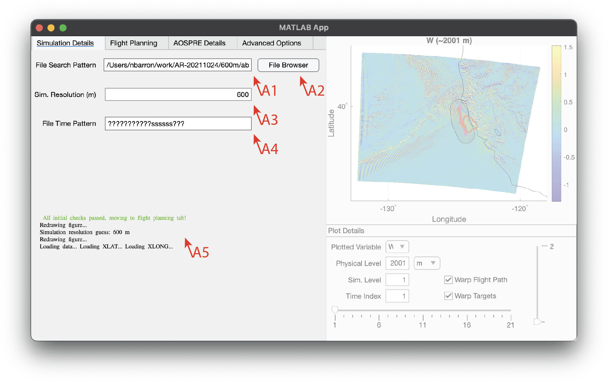
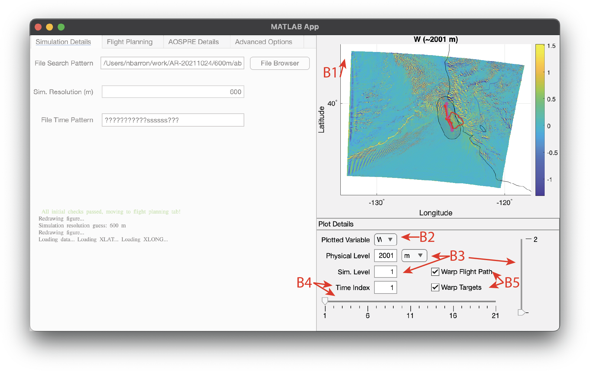
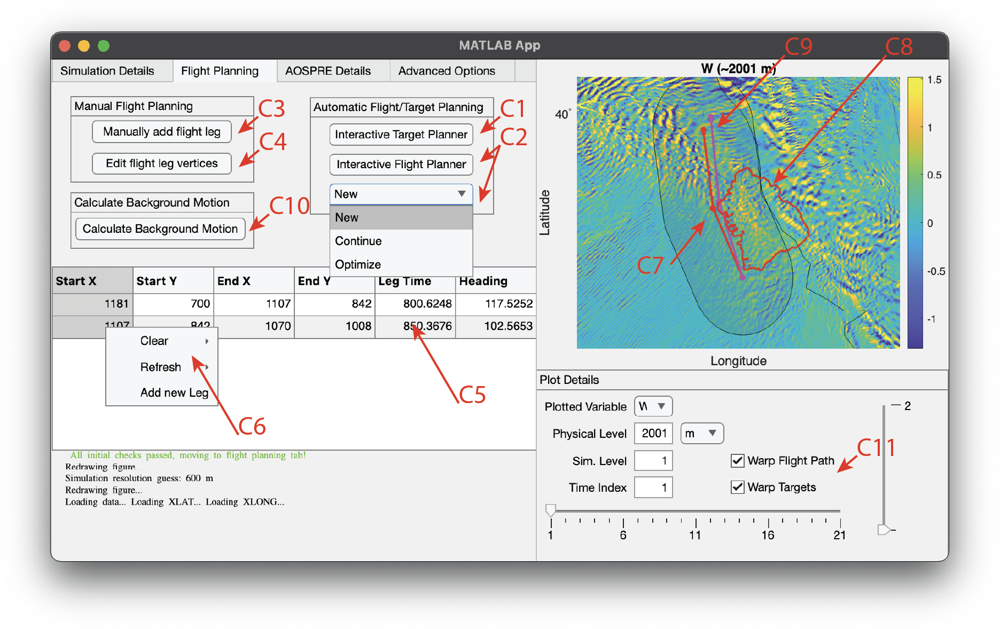
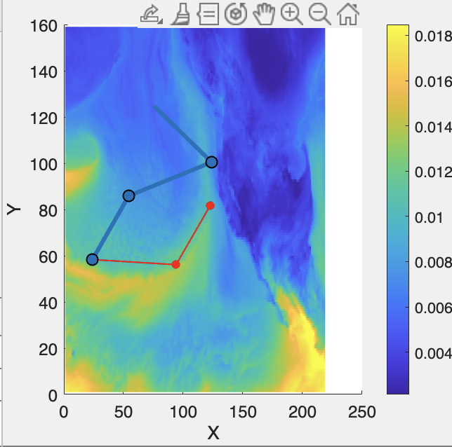

# AOSPRE-GUI instructions
The following instructions will guide you through the various processes of AOSPRE-GUI. 

## Table of Contents
0. [Running AOSPRE-GUI](#running-aospre-gui)
1. [Selecting a simulation](#data-selection)
2. [Data visualizing](#data-visualization)
3. [Flight planning](#flight-planning)
4. [AOSPRE setup](#aospre-setup)
5. [Advanced settings](#advanced-settings) 
6. [Running AOSPRE](#running-aospre)

# Running AOSPRE-GUI
To run AOSPRE-GUI, navigate to the `aospre-gui` directory in your terminal and run the following command:
```bash
matlab -r "run('AOSPRE_GUI.mlapp')"
```

You may also run the `AOSPRE_GUI.mlapp` file directly from the MATLAB GUI by navigating to the aospre-gui directory and double-clicking the file.

# Data selection
## 1. Data preprocessing
To ensure compatibility with AOSPRE, you must preprocess the simulations you wish to use by renaming the simulation's output files to elapsed seconds (e.g., `wrfout_0015500s.nc` where there has been 0015500 seconds since the start of the simulation). 

The python script [`wrfoutToAOSPRE.py`](../helpers/wrfoutToAOSPRE.py) has been provided for the user as a template in cases where the data is not in the default `wrfout_d0X_YYYY-MM-DD_HH:MM:SS` format. If your data is in this format, you can move to the next section and the GUI will automatically rename the files for you.

## 2. Selecting the data
1. The first step in using AOSPRE-GUI is to select the data you want to use for your simulation. You can do this by manually typing the path to the data ([A1]()) or by using the file browser to navigate to the data ([A2]()). If the software detects data saved in an incorrect format, it will prompt you to automatically rename the files, simply press "Yes". Note: this process assumes that the filenames are in the default `wrfout_d0X_YYYY-MM-DD_HH:MM:SS` format.

 

2. The software will try to guess the resolution of the data based on the `XLAT` and `XLONG` variables in the data, check to make sure this is correct. You can manually correct the resolution in [A3]() if necessary.
3. If everything proceeds without error, you can move to the [next section](#data-visualization).

4. However, if there is an error selecting or preprocessing the data, you will see a message in [A5]() that will guide you on how to proceed.

4. Lastly, you may manually set the format for for the time search pattern in the filenames. The default should be correct for most users, but if you have a different format, you can set it in [A4](). The `?` character is a wildcard that will match any character, then set the `s` character at locations in the filename string that corresponds to the elapsed seconds. For example, the image above reflects a filename of `wrfout_0015500s.nc`.

# Data visualization
A simple plotting tool is provided that allows the user to visualize the data and flight paths at the same time. 

- [B1](./images/data-visualization.png) shows the selected variable (yellow to blue color scale) and the flight path (red line).
- Selecting [B2](./images/data-visualization.png) will open a drop down containing all of the variables in the data. The program will try to select the vertical velocity `W`, `Q`, or `QVAPOR` variables by default. 
    - Note: due to the nature of these data, there is no filtering out variables that are not plotted well (i.e., `TIMES`, `XLAT`, `XLONG`, etc.), if you encounter an error like "'Limits' must be a 1-by-2 array of real finite numbers that are increasing." in [A5](./images/data-selection.png), you should select a different variable.
- The slider and edit field [B3](./images/data-visualization.png) allow the user to select the the level to plot. The program automatically selects the vertical level with the highest standard deviation for the selected variable, but you can change it to any level in the simulation.
- The slider and edit field [B4](./images/data-visualization.png) allow the user to select the time step (or file corresponding to said time step) to plot.

# Flight planning
## Manual flight planning
The flight planning tool allows the user to plan a flight path through the simulation data. The user can select the start and end points of the flight path, as well as the number of waypoints in between. There is also an automated flight planning tool that will generate a flight path that tries to optimize the path based on how well it observes a given target.

- For [C1](./images/flight-planning-1.png) and [C2](./images/flight-planning-1.png) see [Automatic flight planning](#automated-flight-planning) for more information on the automated flight planning tool.
- [C3](./images/flight-planning-1.png) opens up a tool for the user to manually draw waypoints on the map (see [C5](./images/flight-planning-1.png)). After pressing the button, hover over the map and click to place a waypoint. The gui will update with a blue polyline after each waypoint (see the figure below). Press `Enter` to finish placing waypoints. If a flight path is already on the map, the tool will start building the path from the last waypoint in the preexisting path.


- To edit the path, press [C4](./images/flight-planning-1.png). This will draw an interactive polyline on the map over the preexisting path. You can click and drag the waypoints to move them. Press `Enter` to finish editing the path. 
- [C5](./images/flight-planning-1.png) is a table of all legs on the flight path and their corresponding metadata:

| Column | Description |
| --- | --- |
| `Start X/Y` | The starting point(s) of the leg in the simulation space |
| `End X/Y` | The ending point(s) of the leg in the simulation space |
| `Leg Time` | The time it takes to traverse the leg. The calculation is based on the aircraft velocity (default = 120 $m s^{-1}$; set in the next page) and the resolution of the simulation (set in the previous page)|
| `Heading` | The heading of the leg in degrees following the math convention (degrees clockwise of East). |


- By selecting a portion of the data in [C5](./images/flight-planning-1.png) and right-clicking, the context menu [C6](./images/flight-planning-1.png) will open. This gives the user several options to manually manipulate the flight path:
    - `Clear/Selection` will set the selected cells to `NaN`. 
    - `Clear/Leg/Row` will delete the entire row of the selected cell.
    - `Refresh/Selection` will refresh the selected cells with the current data in the table. Since there are three pairs of data in the table (start x+y, end x+y, and leg time+heading), you can clear one pair of the data, change any of the other two pairs, and then refresh the table to recalculate the missing pair.
    - `Add new Leg` will add a new row of `NaN`s to the table. The user can then manually input the data for the new leg. If there is an empty row at the end of the table and the user begins to manually draw a new path, the program will automatically fill in the table with the new path data.

## Automated flight planning
The automated flight planning tool allows the user to iteratively plan optimized flight paths through a given simulation. These are based on how well the flight path observes the target and how safe the flight path is to travel. 
### Target selection application
The first step is to choose a target for the flight to observe.

To do this, select [C1](./images/flight-planning-1.png) and a new window will open (see below).
.
- There are three different options for choosing the target. This algorithm is based on the active contours model (Chan and Vese 2001), which is a method for segmenting images based on a 'seed' point(s), a growth tendency, and number of iterations (default is 200; set in [D7](./images/target-planning-1.png)). Positive growth tendencies tends to shrink, negative tends to grow; however, for exceptionally smooth fields (like the one shown here), you will need to use a more aggressive positive value and vice versa.
    - [D1a](./images/target-planning-1.png) allows the user to put point ROIs on the map. Press `Esc` to finish placing points. The default growth tendency is `-0.2`, since the growth algorithm must often grow substantially outwards from each point to capture the entire target.
    - [D1b](./images/target-planning-1.png) allows the user to draw a polyline ROI on the map. To finish, press `Enter`. The default growth tendency is `-0.1`, since the region must grow to fill the target, but not as much as the point ROI.
    - [D1c](./images/target-planning-1.png) allows the user to draw a polygon ROI on the map. To finish drawing, completely enclose the polgygon around the desired target. The default growth tendency is `0.1`, since the region must shrink around the target.
- When you are done, the program will attempt to segment the target from the background image (see below).  

- If you are satisfied with the results, click on [D2](./images/target-planning-1.png) to finalize the target. You may then add a new target by following the same steps. 
- If you are not satisfied:
    - You may erase contiguous regions of the target by selecting [D3](./images/target-planning-1.png) and clicking on the map (press `Esc` to finish). 
    - You can also clear the entire target by selecting [D4](./images/target-planning-1.png).
- After adding all targets, cleaning up the targets, and finalizing the targets, select [D5](./images/target-planning-1.png) to close the window, export the targets to the main AOSPRE-GUI software, and return to the flight planning page.

#### Target metadata
- Finally, in cases where a certain target is more important, you can assign a weight to each target before finalizing. Enter your desired weight in [D6a](./images/target-planning-1.png). The flight planning program functions best when the weight of targets is greater than 5 and less than 30.
- [D6b](./images/target-planning-1.png) allows the user to set the desired dwell time for each target. This is the amount of time the aircraft should spend observing the target. The default is 0 seconds, which means the aircraft has no limit on how long it can observe the target before the weight of the target is reduced. This setting is not yet fully implemented in the flight planning algorithm, but it will be in the future.
### Flight planning application
After selecting the targets, the user can begin the automated flight planning process. First, in the dropdown [C2](./images/flight-planning-1.png) select 'Start new flight' to erase any existing flight path, or 'Continue' to build off a preexisting path. Then select `Interactive Flight Planner`. A new window will open (see below). This algorithm is a modified version of rapidly expanding random trees (LaValle and Kuffner 1999). The details of this algorithm are in [flight-planning-details.md](./flight-planning-details.md).

#### Training settings
- [E1a](./images/flight-planning-3.png) sets the desired path length (in hours) for the flight.
- [E1b](./images/flight-planning-3.png) sets the learning rate. This is how quickly the algorithm reduces the number of random samples in the environment vs. the number of samples near high-quality paths. The default is `0.008`, which means the algorithm will spend the first $\frac{0.5}{0.008}\sim 63$ iterations learning the environment before only sampling points near high-quality legs. For complex environments, the learning rate should be lower than the default, but simpler environments may benefit from a higher learning rate.
- [E1c](./images/flight-planning-3.png) sets the number of iterations the algorithm will run. The default is `100`, which is sufficient for most environments.
- [E1d](./images/flight-planning-3.png) sets the number of new nodes to add to the network simultaneously. The nodes in a single parallel computation will not build on one another, just the pre-existing network. The default is `100`, which is sufficient for most environments.

#### Running the program
- Set the start position and direction of the aircraft by pressing [E2a](./images/flight-planning-3.png) and clicking and dragging on the map. The aircraft will start at the point where you first pressed the mouse button. In cases where you are continuing a path, the aircraft will start at the last waypoint in the preexisting path.
- Press [E2b](./images/flight-planning-3.png) to finalize the start position. After this is pressed, the blue line will turn into a red arrow. You can always change the start position by pressing [E2a](./images/flight-planning-3.png) again. This button will also reset the network if you choose to restart the training.
- Press [E2c](./images/flight-planning-3.png) to begin the training process. The program will run the algorithm for the number of iterations set in [E1c](./images/flight-planning-3.png). 
    - The program will update the map with the new path after every second iteration.
    - The network will condense (combine nearby nodes $<3$ km apart) every 10 iterations.
    - The network will trim (remove low-quality paths) every 4 iterations after the halfway point in training.
    - See [flight-planning-details.md](./flight-planning-details.md) for more information on the algorithm.
- Press the start and stop buttons [E2d](./images/flight-planning-3.png) to start and stop the training process. The program will automatically stop after the number of iterations set in [E1c](./images/flight-planning-3.png) is reached.

#### Plotting tools
There are three main parts to the plotted network:
- The orange network with blue nodes is the network of paths that the algorithm has built ([E3a](./images/flight-planning-3.png)). The size of the nodes is inversely proportional to the quality of the leg.
- The red contours ([E3b](./images/flight-planning-3.png)) are the regions of high quality legs where the algorithm is more likely to sample points. These will shift throughout the training process as the network learns the environment.
- The blue paths ([E3c](./images/flight-planning-3.png)) are the paths that the algorithm has deemed high quality. You can select a path by clicking on it, and the program will highlight the path in green. You may stop the training at any time and pick a path.
#### Saving the path and exporting to the main GUI
- After you have selected a path, press [E4](./images/flight-planning-3.png) to finalize the path and press [E5](./images/flight-planning-3.png) to export the path to the main GUI. These buttons will turn green when you can press them.
    - Note: the path may dissapear after pressing 'Finalize Path'. This is normal, since the path object has been moved to a buffer before being moved to the main GUI.
- As before, you may edit this path manually or interactively by pressing [C4](./images/flight-planning-1.png) in the main GUI after exporting the path.

# AOSPRE setup
